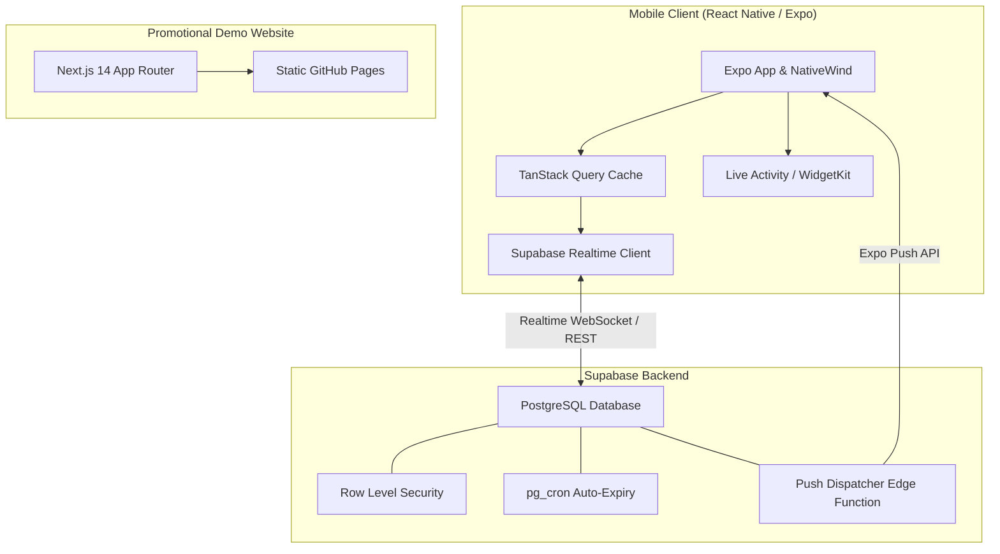

# Vicin (Vicinity)

<p align="center">
  <strong>Spontaneous neighborhood & group availability broadcasting for trusted micro-communities.</strong>
</p>

<p align="center">
  <a href="https://github.com/FranekJemiolo/vicin/actions/workflows/ci.yml">
    
  </a>
  <a href="https://github.com/FranekJemiolo/vicin/actions/workflows/pages.yml">
    
  </a>
  <a href="https://github.com/FranekJemiolo/vicin/blob/main/LICENSE">
    
  </a>
  
  
  
  
</p>

---

## 🌟 What is Vicin?

**Vicin** is a mobile-first, privacy-respecting availability broadcast tool designed for trusted, closed-loop groups (e.g. apartment neighbors, residential dorms, coworker pods, close friend groups).

Instead of cluttering messy group chats with messages like _"anyone free for a coffee?"_ or _"walking dog in 10 mins"_, members broadcast a lightweight, time-bound pulse with **zero conversational friction**:

- ⏱️ **Time-Bound**: Every broadcast automatically self-expires (e.g. 30m, 1h, 2h).
- 🔒 **Closed-Loop Privacy**: Strict PostgreSQL Row Level Security (RLS) guarantees data is never visible outside verified group members.
- ⚡ **1-Tap "I'm In"**: Fast acknowledgments without notification spam.
- 📱 **Glanceable OS Integration**: Home screen widgets and lock-screen Live Activities track active broadcasts at a glance.

---

## 🏗️ Architecture



---

## 📁 Monorepo Layout

```
vicin/
├── .github/
│   └── workflows/
│       ├── ci.yml               # Automated linting, formatting, type-check, and tests
│       └── pages.yml            # Next.js static export deployment to GitHub Pages
├── apps/
│   ├── mobile/                  # React Native / Expo application (EAS, NativeWind)
│   └── web/                     # Next.js 14 App Router promotional demo site
├── packages/
│   ├── backend/                 # Supabase migrations, RLS policies, Edge Functions
│   ├── shared/                  # Cross-platform types, time calculation, DTOs
│   └── ui/                      # Shared Tailwind theme preset & design tokens
├── .maestro/                    # Automated mobile E2E interaction and screenshot flows
├── pnpm-workspace.yaml          # Monorepo workspace configuration
├── package.json                 # Monorepo root scripts & dev tools
└── tsconfig.base.json           # Unified TypeScript base compiler options
```

---

## 🚀 Quick Start

### Prerequisites

- [Node.js](https://nodejs.org/) `>= 20.0.0`
- [pnpm](https://pnpm.io/) `>= 9.0.0`
- [Supabase CLI](https://supabase.com/docs/guides/cli) (optional for local database emulator)
- [Expo Go](https://expo.dev/go) or iOS Simulator / Android Emulator

### 1. Install Dependencies

```bash
pnpm install
```

### 2. Build Shared Packages

```bash
pnpm run build:shared
pnpm run build:ui
```

### 3. Run Quality Checks

```bash
pnpm run lint          # Run ESLint across packages
pnpm run format:check  # Verify Prettier code formatting
pnpm run type-check    # Strict TypeScript verification
pnpm run test          # Execute unit and security test suites
```

### 4. Start Development Servers

- **Web Demo**:
  ```bash
  pnpm run dev:web
  ```
- **Mobile App**:
  ```bash
  pnpm run dev:mobile
  ```

---

## 🛡️ License

Released under the [MIT License](LICENSE).
