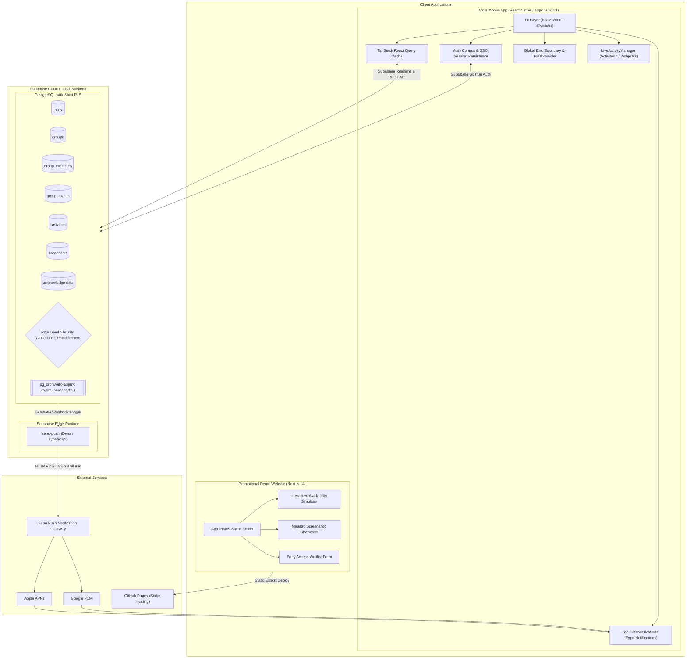

# Vicin (Vicinity)

<p align="center">
  <strong>Spontaneous neighborhood & closed-loop availability broadcasting for trusted micro-communities.</strong>
</p>

<p align="center">
  <a href="https://github.com/FranekJemiolo/vicin/actions/workflows/ci.yml">
    
  </a>
  <a href="https://github.com/FranekJemiolo/vicin/actions/workflows/pages.yml">
    
  </a>
  <a href="https://github.com/FranekJemiolo/vicin/blob/main/LICENSE">
    
  </a>
  
  
  
  
  
</p>

---

## 🌟 What is Vicin?

**Vicin** is a mobile-first, privacy-respecting availability broadcast system designed for trusted, closed-loop groups (e.g. apartment neighbors, residential dorms, coworker pods, close friend groups).

Instead of cluttering messy group chats with messages like _"anyone free for a coffee?"_ or _"walking dog in 10 mins"_, members broadcast a lightweight, time-bound pulse with **zero conversational friction**:

- ⏱️ **Time-Bound**: Every broadcast automatically self-expires (e.g. 15m, 30m, 45m, 1h, 2h).
- 🔒 **Closed-Loop Privacy**: Strict PostgreSQL Row Level Security (RLS) guarantees data is never visible outside verified group members.
- ⚡ **1-Tap "I'm In"**: Instant acknowledgments without conversational back-and-forth.
- 📱 **Glanceable OS Integration**: Home screen widgets and lock-screen Live Activities track active broadcasts at a glance.
- 🌐 **Web Demo & Simulator**: Interactive Next.js static landing page deployed on GitHub Pages with simulated availability broadcasts and early access waitlist.

---

## 🏗️ Comprehensive Architecture



---

## 🔒 Database Schema & Security Architecture

Vicin adheres to a zero-trust, closed-loop relational model in PostgreSQL:

| Table             | Primary Purpose               | Key Fields                                                         | RLS Policy                                                                                        |
| :---------------- | :---------------------------- | :----------------------------------------------------------------- | :------------------------------------------------------------------------------------------------ |
| `users`           | Member identity & push tokens | `id`, `email`, `name`, `avatar_url`, `expo_push_token`             | Users can only modify their own profile; public profile reads restricted to shared group members. |
| `groups`          | Isolated neighborhood pods    | `id`, `name`, `created_by`, `created_at`                           | Only authenticated members can view group metadata.                                               |
| `group_members`   | Membership & permissions      | `group_id`, `user_id`, `role`, `push_enabled`                      | Admin role required to remove members; users can voluntarily leave; per-group push preference.    |
| `group_invites`   | Cryptographic invite tokens   | `id`, `group_id`, `token`, `status`, `expires_at`                  | Only group members can issue invites; invite redemption verifies validity.                        |
| `activities`      | Group activity dictionary     | `id`, `group_id`, `name`, `emoji`, `default_duration_mins`         | Scoped strictly to members of the specific group.                                                 |
| `broadcasts`      | Ephemeral availability pulse  | `id`, `user_id`, `group_id`, `activity_id`, `expires_at`, `status` | Read scoped strictly to group members where `expires_at > NOW()`. Mutation restricted to author.  |
| `acknowledgments` | 1-tap "I'm in" responses      | `id`, `broadcast_id`, `user_id`, `created_at`                      | Only group members can insert/delete their own acknowledgment.                                    |

### Automatic Status Expiration (`pg_cron`)

Broadcast statuses are automatically maintained using PostgreSQL background workers:

```sql
CREATE OR REPLACE FUNCTION expire_broadcasts() RETURNS void AS $$
BEGIN
  UPDATE broadcasts
  SET status = 'expired'
  WHERE status = 'active' AND expires_at <= NOW();
END;
$$ LANGUAGE plpgsql;

SELECT cron.schedule('expire-broadcasts-every-minute', '* * * * *', 'SELECT expire_broadcasts()');
```

---

## 📁 Monorepo Layout

```
vicin/
├── .github/
│   └── workflows/
│       ├── ci.yml               # Automated linting, formatting, type-check, and tests
│       └── pages.yml            # Next.js static export deployment to GitHub Pages
├── apps/
│   ├── mobile/                  # React Native / Expo application (EAS, NativeWind)
│   │   ├── eas.json             # EAS build profiles (dev, preview simulator/APK, prod)
│   │   ├── plugins/             # Expo Config Plugins (withLiveActivities, withWidgets)
│   │   └── src/                 # Screens, navigation, hooks, and context providers
│   └── web/                     # Next.js 14 App Router promotional demo site
│       ├── public/assets/       # Maestro captured flow screenshot artifacts
│       └── src/app/             # Landing page, simulator, waitlist, privacy policy
├── packages/
│   ├── backend/                 # Supabase migrations, RLS tests, Edge Functions
│   ├── shared/                  # Cross-platform types, time calculation, DTOs
│   └── ui/                      # Shared Tailwind theme preset & atomic components
├── .maestro/                    # Automated mobile E2E interaction and screenshot flows
│   ├── flow.yaml                # Core authentication and broadcast creation flow
│   └── invite_flow.yaml         # Deep-link invite redemption and multi-user participation
├── pnpm-workspace.yaml          # Monorepo workspace configuration
├── package.json                 # Monorepo root scripts & dev tools
└── tsconfig.base.json           # Unified TypeScript base compiler options
```

---

## 🏆 Development Milestones & Roadmap (100% Completed)

- [x] **Milestone 1:** Monorepo Initialization & CI/CD Setup (`pnpm` workspace, ESLint, Prettier, GitHub Actions CI).
- [x] **Milestone 2:** Backend Architecture (Supabase SQL migrations, closed-loop RLS policies, `send-push` Edge Function).
- [x] **Milestone 3:** Mobile Client Foundation & Authentication (Expo SDK 51, React Navigation, Supabase SSO Auth).
- [x] **Milestone 4:** Core Domain: Groups & Activities (`useGroup`, invite links `vicin://invite/:token`, custom activities).
- [x] **Milestone 5:** The Broadcast Loop (`useBroadcasts`, Supabase Realtime channel, 1-tap "I'm in" acknowledgment).
- [x] **Milestone 6:** OS Integration (Expo Config Plugins for iOS Live Activities ActivityKit & WidgetKit SwiftUI).
- [x] **Milestone 7:** Testing, Artifacts & Demo Site Deployment (Maestro flow, Next.js App Router, GitHub Pages).
- [x] **Milestone 8:** UI Component Library Initialization (`@vicin/ui` atomic Button, Badge, Card, Avatar, StatusIndicator).
- [x] **Milestone 9:** Advanced Supabase RLS Hardening (Cross-group leakage test suite, non-author mutation guards).
- [x] **Milestone 10:** State Management & Optimistic UI (TanStack Query optimistic mutations and rollback handlers).
- [x] **Milestone 11:** Push Notification Pipeline (`usePushNotifications`, token lifecycle, response deep linking).
- [x] **Milestone 12:** Advanced Group Management Edge Cases (Admin kicks, voluntary leaves, role promotions).
- [x] **Milestone 13:** Granular Notification Preferences (Per-group `push_enabled` toggle and recipient filtering).
- [x] **Milestone 14:** Profile & Account Settings (Display name, avatar presets, GDPR cascading account deletion).
- [x] **Milestone 15:** Feed Polish & Empty States (Skeleton loader, interactive empty state with CTAs).
- [x] **Milestone 16:** Error Boundaries & Telemetry (Global ErrorBoundary, in-app Toast notification provider).
- [x] **Milestone 17:** EAS Build Configuration (`eas.json` development, preview simulator/APK, and production profiles).
- [x] **Milestone 18:** Advanced End-to-End Test Suite (Multi-user invite and participation Maestro flows, asset sync).
- [x] **Milestone 19:** Demo Website SEO & Polish (OpenGraph metadata, favicon, manifest, interactive waitlist).
- [x] **Milestone 20:** Final Delivery & Architecture Diagrams (Mermaid architecture diagrams, release documentation).

---

## 🚀 Quick Start & Local Development

### Prerequisites

- [Node.js](https://nodejs.org/) `>= 20.0.0`
- [pnpm](https://pnpm.io/) `>= 9.0.0`
- [Supabase CLI](https://supabase.com/docs/guides/cli)
- [Expo Go](https://expo.dev/go) or iOS Simulator / Android Emulator

### 1. Clone & Install Dependencies

```bash
git clone https://github.com/FranekJemiolo/vicin.git
cd vicin
pnpm install
```

### 2. Build Shared Workspace Packages

```bash
pnpm run build:shared
pnpm run build:ui
```

### 3. Run Quality & Verification Pipeline

```bash
pnpm run lint          # Run ESLint across all apps and packages
pnpm run format:check  # Verify Prettier code formatting
pnpm run type-check    # Strict TypeScript compiler verification
pnpm run test          # Execute all 23 unit, RLS security, and configuration tests
```

### 4. Start Local Supabase Stack (Optional)

```bash
cd packages/backend
supabase start
supabase db reset # Applies 0001, 0002, 0003 migrations and seed.sql
```

### 5. Launch Development Clients

- **Start Mobile App (Expo)**:
  ```bash
  pnpm run dev:mobile
  # Press 'i' for iOS Simulator or 'a' for Android Emulator
  ```
- **Start Web Demo (Next.js)**:
  ```bash
  pnpm run dev:web
  # Open http://localhost:3000
  ```

---

## 📱 EAS Build Commands

```bash
# Build development client
pnpm --filter @vicin/mobile run build:dev

# Build preview build (iOS simulator .tar.gz & Android standalone APK)
pnpm --filter @vicin/mobile run build:preview

# Build production bundle (App Store & Google Play AAB)
pnpm --filter @vicin/mobile run build:prod
```

---

## 🛡️ License

Released under the [MIT License](LICENSE). Built with ❤️ by [Franek Jemiolo](https://github.com/FranekJemiolo).
